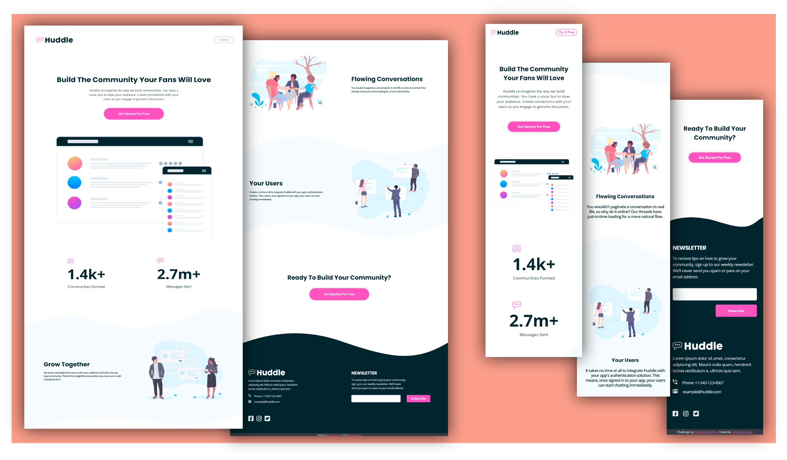

# Frontend Mentor - Huddle landing page with curved sections

This is a solution to the [Huddle landing page with curved sections challenge on Frontend Mentor](https://www.frontendmentor.io/challenges/huddle-landing-page-with-curved-sections-5ca5ecd01e82137ec91a50f2). 

## Screenshot

### Links

- Live Site URL: [https://cataclas.github.io/Frontend-Mentor_Huddle-landing-page-with-curved-sections/](https://cataclas.github.io/Frontend-Mentor_Huddle-landing-page-with-curved-sections/)

## Built with

- Semantic HTML5 markup
- [CSS custom properties](https://devdocs.io/css/)
- [@media](https://devdocs.io/css/@media)
- [@keyframes](https://devdocs.io/css/@keyframes)
- Responsive
- [jQuery](https://api.jquery.com/)
 

## Author

- Frontend Mentor - [@Cataclas](https://www.frontendmentor.io/profile/Cataclas)
